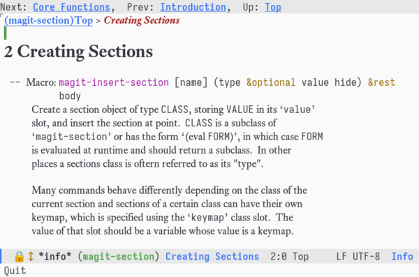
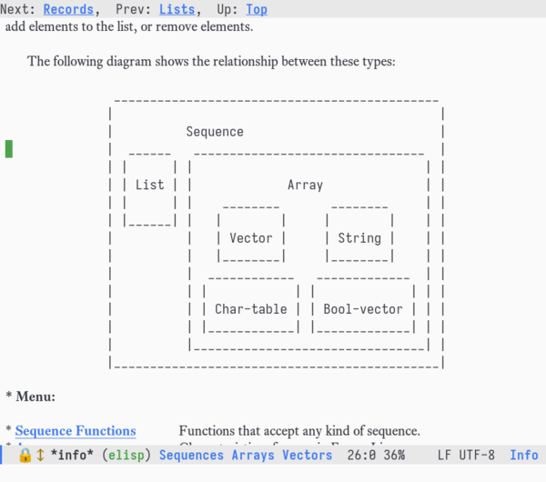
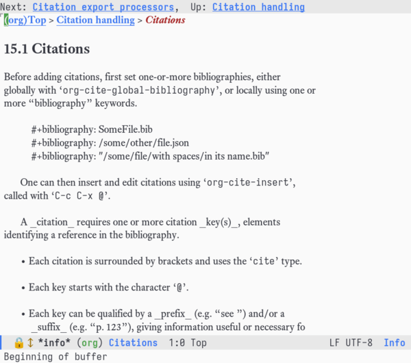

# info-variable-pitch

Like [org-variable-pitch][OVP] but for Info.

 

Caveat: Info formatting is quite a bit more chaotic than Org syntax, so this does not produce as perfect a result as org-variable-pitch does for Org. For example, here the code block cannot be reliably detected as a code block.



## Install

```elisp
(straight-use-package '(info-variable-pitch :type git :host github :repo "kisaragi-hiu/info-variable-pitch"))
```

Then add it to `Info-mode-hook`:

```elisp
(add-hook 'Info-mode-hook #'info-variable-pitch-mode)
```

## Acknowledgement

This is heavily based on [org-variable-pitch][OVP]. I just looked at how org-variable-pitch does it and adapted it for Info.

## License

[org-variable-pitch][OVP] by [Göktuğ Kayaalp](https://github.com/cadadr) is licensed under GPLv3.

This package is also licensed under GPLv3.

[OVP]: https://github.com/cadadr/elisp/blob/stable/org-variable-pitch.el
